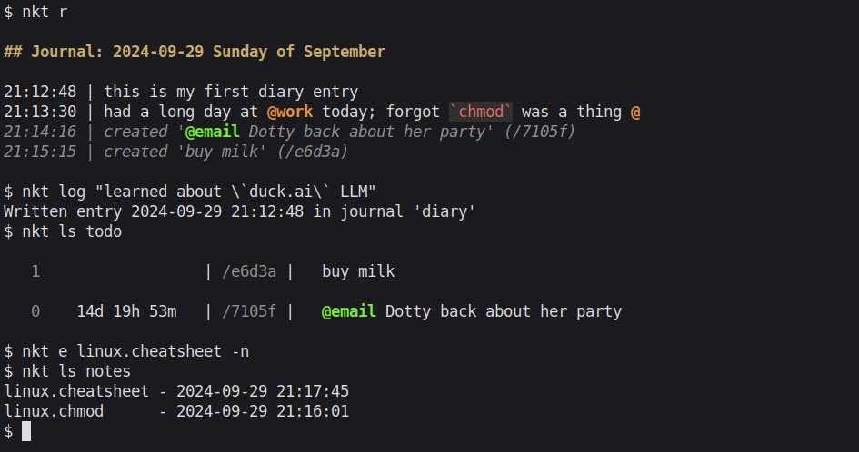

# nkt

<p align="center">
  
</p>

_A(nother) note taking solution for terminal enthusiasts._

nkt is a command line tool for helping you track and build your notes, todo
lists, habits, and more. nkt mixes a number of different note-taking idioms,
with inspiration from applications like [Dendron](https://www.dendron.so/),
[jrnl](https://github.com/jrnl-org/jrnl),
[vim-wiki](https://github.com/vimwiki/vimwiki) and methods such as the
incremental note-taking method, "Dont break the chain" and
[Zettelkasten](https://en.wikipedia.org/wiki/Zettelkasten).

Features:
- Bring your own `$EDITOR`
- Bring your own reader / renderer
- Bring your own document format (Markdown, LaTeX, typst, RST, ...)
- _Everything_ stored as plain text and JSON, so easy to migrate if you end up hating it
- Support for journals, tasklists, notes, chains, and more...
- Tag things to help search your notes
- Fuzzy find **anything and everything**. nkt solves the problem of linking notes together to make navigation easy by letting you fuzzy find everything interactively similar to [fzf](https://github.com/junegunn/fzf).

## Quick start <a id="toc-tag-mdtoc" name="quick-start"></a>

Download the binary for your architecture from [the latest
release](https://github.com/fjebaker/nkt/releases/latest). Put the binary in
your `$PATH` and then initialize the home directory (`~/.nkt`):
```bash
nkt init

# log to a journal
nkt log "this is my first diary entry"

# create a new note
nkt edit books.reading-list --new

# edit an existing note
nkt edit films.watch-list

# search all notes with a fuzzy finder
nkt find

# add an item to your todo list
nkt task "learn more about that thing" --due monday

# list your tasks
nkt ls todo

# list your notes in the `notes` directory
nkt ls notes

# create a tag
nkt new tag work
nkt log "i am currently at @work"

# search journal entries matching a tag
nkt read --all @work

# list your tags
nkt ls tags
```

<!--BEGIN TOC-->
## Table of Contents
1. [Quick start](#quick-start)
2. [Description](#description)
3. [Usage](#usage)
    1. [Shell completion](#shell-completion)
4. [Concepts and details](#concepts-and-details)
    1. [Tags](#tags)
    2. [Text compilers](#text-compilers)
5. [Configuration](#configuration)
6. [Reference](#reference)
7. [Installation](#installation)
    1. [From source](#from-source)
8. [Known issues](#known-issues)
9. [Disclaimer](#disclaimer)

<!--END TOC-->

## Description <a id="toc-tag-mdtoc" name="description"></a>

The design of nkt is centered around making it easy to get information into
your notes, and making it easy to get information _back out again_.
Principally, nkt provides four different ways to record information:

- Journal

  A journal is a collection of _days_, each of which is a collection of
  _entries_. The journal is the standard way to quickly jot something down you
  might want to remember; the command is designed to be short and sweet and to
  get out of the way quickly so you can continue on with what you were doing.

  Every entry in the journal is timestamped, and can be tagged using in-place tags
  or using post-fix tags. See [Tags](#Tags).

- Notes

  Notes are (longer form) textual notes that are kept in _directories_. Notes
  have dot-hierarchical names, so you don't have a directory called `music` and
  another one called `composers` into which you put `Bach.md`, but rather you
  have `music.composers.Bach.md`.

  Each note can be compiled with a text compiler into a rendered note for easy
  reading and navigation. See [Text compilers](#Text-compilers).

- Tasks

  A task is kept in a _tasklist_, and represents a todo-item. Tasks can be
  given due dates (see [Semantic time](#Semantic-time)), have importance assigned
  to them, be tagged in various ways, and even have notes and descriptions
  attached to them.

- Chains

  Chains are for building habits. A chain is given a task or habit you are
  trying to build and then it can be checked off each day you complete that tasks.

- Stacks

  Stacks are for keeping track of how you got to the current state of
  something. They are stacks of notes that maintain a FIFO ordering. The use
  case they were supposed to address was for keeping track of reference trails
  when reading a paper.

## Usage <a id="toc-tag-mdtoc" name="usage"></a>

To setup `nkt`, use the `init` command.
```
$ nkt help init
Extended help for 'init':

(Re)Initialize the home directory structure.

You can override where the home directory is with the `NKT_ROOT_DIR`
environment variable. Be sure to export it in your shell rc or profile file to
make the change permanent.

Initializing will create a number of defaults: a directory "notes", a journal
"diary", a tasklist "todo".

These can be changed later if desired. You must always have some defaults
defined so that nkt knows where to put things if you don't tell it otherwise.


Arguments:

    [--reinit]                Only create missing files and write missing
                                configuration options.
    [--reinit-all]            Opens and rewrite the ENTIRE nkt topology system. Useful
                                for reformatting JSON or applying modifications. Not for
                                general use.
    [--force]                 Force initializtion. Danger: this will overwrite *all*
                                topology files.
```

And that's it! You're all setup.

### Shell completion <a id="toc-tag-mdtoc" name="shell-completion"></a>

nkt brings shell completion so you can use Tab to complete command line
arguments, note names, even select specific entries from journals.

There is shell completion for the following shells:

- zsh:

  Generate the completions file
  ```
  nkt completion > _nkt
  ```
  Then move the `_nkt` file into your zsh completion path (e.g. `~/.zsh_completions/`).

- Sorry, I only really use `zsh` at the moment and writing completion files is not a hobby of mine.

## Concepts and details <a id="toc-tag-mdtoc" name="concepts-and-details"></a>

Before we look at how to put information _in_ to nkt, let's quickly talk about
a few ways of getting information _out_ of nkt. For any successful note taking
application, it's important to know how to find things again.

Most nkt commands that interact with something in your knowledge base use a
selector to do so. The selector can be a pretty general statement, and has some
semantic additions built in; for example:

- A number, like `1`, `4`, `7` means "n days ago". `1` will select yesterday. `0` is today.
- A date `2024-01-07` (in `YYYY-MM-DD`) will also select a specific day.
- A qualified number like `t1` or `t8` will select a specific task (we'll get
  onto those later).
- A name `art.pre-raphaelite` or `maths` will select an item by name. This
  could be the name of a note or the title of a task.

You can test what a selection will do using the `select` command. All of these
can be made more granular by including, say, a `--journal work` flag to
indicate you want to select `2` days ago in the `work` journal.

To select a specific entry, you need to choose both a day and pass a `--time
HH:MM:SS` flag. This is where shell completion comes in handy, as you can do
`nkt select 0 --time <TAB>` and a list of times will come up to select from.

Often, though, you don't know where something is stored, you just know it's
somewhere. That's where `find` comes in useful as a fuzzy text finder. It's
worth just having a look at `help find` to see what you can do with it, and
also to know that it's aliased to `f` so you can just do `nkt f` when you're in
a rush.

The other commands you will likely end up using the most are `log`, `read`, and
`edit`. So let's introduce the stars of the show:

- `log` is used to add a new entry to a journal. It's there so when you need to
  quickly jot down an idea or a thought it's there for you. Log stores a
  timestamp for every entry so you can flick back through them easily.

- `read` is used to read different things. Without any arguments read will just
  print the last `n` entries from you journal, interweaved with any status
  changes in your tasklists. You can also use it to read specific notes, which
  will just get printed directly to your terminal.

- `edit` is used to add new notes into a directory or to modify existing
  information. `edit` will only create a new note if you tell it to, to avoid
  accidentally adding notes you didn't mean to.

  You can also use edit to modify an entry by selecting it by its timestamp on
  a certain day.

  If given no arguments, `edit` will go interactive (like `find`) and let you
  fuzzy search through the names of your notes. See `help edit` for more details.

This is probably enough to get going. Have a look at [Tags](#tags) to learn
more about organising your notes effectively, and [Text
compilers](#Text-compilers) to learn how to produce rendered versions of your
notes.

### Tags <a id="toc-tag-mdtoc" name="tags"></a>

Tags are used to group notes together to make finding what you know about a
certain thing a little more structured. Tags are always prefixed with an `@`
symbol, such as `@tag`. To avoid spuriously introducing new tags, nkt forces
you to define a set of tags that you are going to use. You can do this with the
`new` command.

```
nkt new tag project.sewing
```

will create a new _hierarchical tag_ `project.sewing`. This means that the tag
is matched if you search for `@project` or `@project.sewing`. Similar to the
hierarchical naming convention of the notes themselves, the naming is to help
you subgroup and make clusters of information increasingly granular.

You can tag pretty much _anything_. To tag a selected item use

```
nkt tag --journal work 2 @meeting.town-hall
```

This will tag the day before yesterday in the work journal with
`@meeting.town-hall`.

When writing entries or tasks, you can also use inline tag syntax

```
nkt log "wrote an @email back to dorothy"
nkt task "learn more @vim shortcuts" --due tuesday
```

These are automatically parsed and the entry / task is tagged with the
corresponding tag. The intended use is to make **tags semantically
meaningful**, so they can be embedded into sentences as you type the note.

The `log` command also supports out-of-place tagging

```
nkt log "arrived at the office" @work
```

These tags will not appear in the body of the entry but are the equivalent of having used

```
nkt log "arrived at the office"
nkt tag 0 --last @work
```

You can use tags to guide your searches, or list everything tagged with a
certain tag using the `list` command
```
nkt ls @work
```

### Text compilers <a id="toc-tag-mdtoc" name="text-compilers"></a>

Text compilers are used to render a note. You can use pretty much any program
under the sun to do this, but for example you might want to use `typst` or
`pandoc` for specific note types.

You can compile a note with
```
nkt compile --directory recipes dip.hummus --open
```

This will use a text compiler to render a PDF of your note. The `--open` flag
will then open the compiled note in your configured `pdf` viewer.

See `help compile` for more information.

nkt comes with some default text compilers. You can list those available as
well as the note extensions they support with
```
$ nkt (main) $ nkt ls compilers

Compiler:         markdown
 - Extensions:    md

Compiler:         typst
 - Extensions:    typ
```

Let's add a new one that will print the note out of an Epson thermal printer,
so e.g. we can export our recipes quickly. We have to edit
`~/.nkt/topology.json` to do this, and under the `text_compilers` heading add
```json
{
    "name": "epson",
    "command": [
        "/home/lilith/Developer/printing/print.py",
        "--print",
        "%<"
    ],
    "link": "%NAME",
    "extensions": [
        "md",
        "txt"
    ]
}
```
We give the name of the text compiler, the shell command used to execute the compiler (using `%<` and `%@` to denote the input and output file respective, similar to Make), and specify any other flags we might want to add.

Next the `link` entry tells nkt how to translate links. See the `markdown` and `typst` entries for examples. These are used to build links between one compiled note and another.

Finally we give a list of extensions that this text compiler is valid for. We can use it by specifying the compiler, or it will be default selected if no other compilers for a given extension are available

```
nkt compile --directory recipes dip.hummus --compiler epson
```

## Configuration <a id="toc-tag-mdtoc" name="configuration"></a>

Most things are pretty self evident regarding what they do. Check the
`~/.nkt/topology.json` to see the configuration, and edit this file as you
please.

## Reference <a id="toc-tag-mdtoc" name="reference"></a>

Please use
```
nkt help [subcommand]
```
for up-to-date reference and documentation for each command.

## Installation <a id="toc-tag-mdtoc" name="installation"></a>

Grab one of the binaries from the [release]() for your architecture:

- Linux Aarch64 (musl)
- Linux x86_64 (musl)
- MacOS M1
- MacOS Intel
- I don't know how to Windows

### From source <a id="toc-tag-mdtoc" name="from-source"></a>

Clone this GitHub repository, and have [Zig]() installed. nkt tracks the master
branch of zig so the latest release should work, but just the definitive
version can be found in the `.zigversion` file in this repository.

```bash
git clone https://github.com/fjebaker/nkt \
    && cd nkt \
    && zig build -Doptimize=ReleaseSafe
```

## Known issues <a id="toc-tag-mdtoc" name="known-issues"></a>

- Datetimes are ruining my life.

## Disclaimer <a id="toc-tag-mdtoc" name="disclaimer"></a>

I am writing nkt to fit my note taking and productivity needs. If it works for you, that's awesome, and we should be friends. If it doesn't, we should still be friends. But since the primary audience of nkt is _me_, please don't get too annoyed at me for rejecting feature requests, and feel free to fork the code and tailor the application towards your needs.

If nkt deletes all your notes for whatever reason, I am sorry, hopefully you did the `git` integration so have backups of them all, but also, this software has no warranties and I claim no responsibility for the information you put into your notes or access via nkt.

---

Dependencies:
- [frmdstryr/zig-datetime](https://github.com/frmdstryr/zig-datetime)
